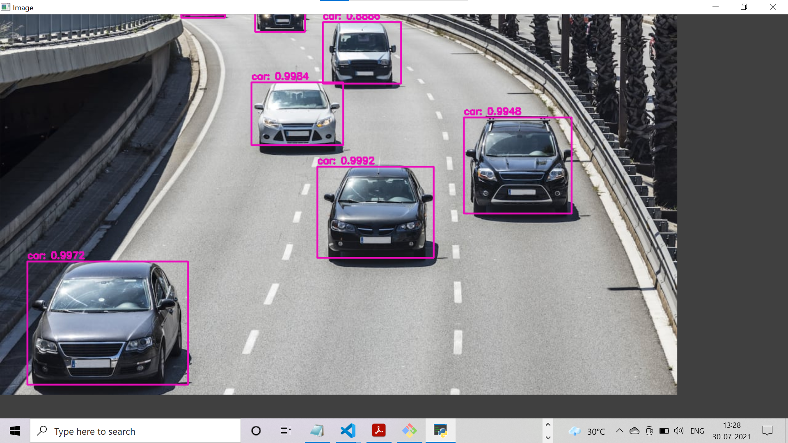
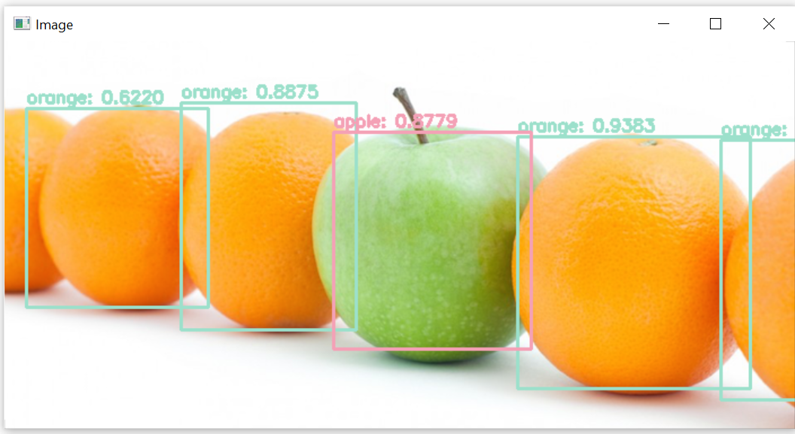
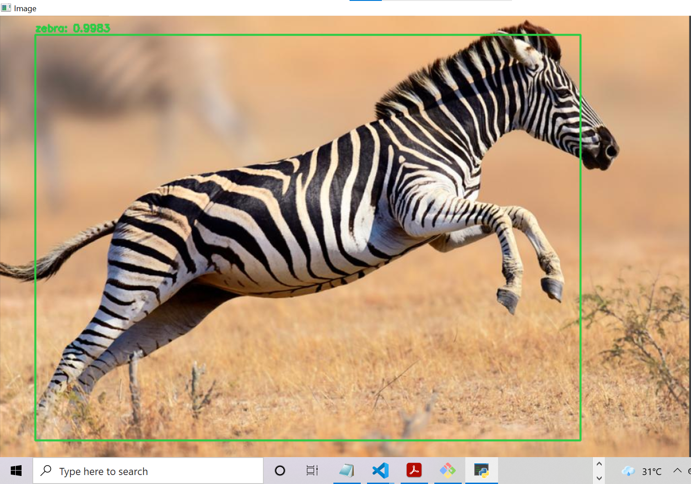
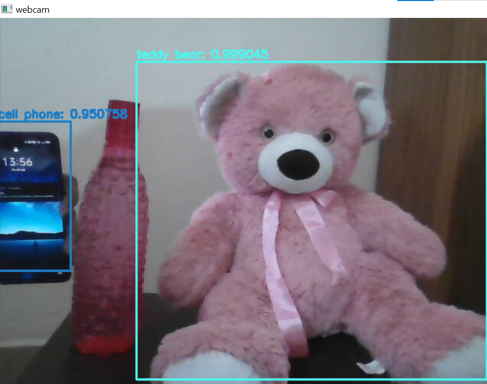
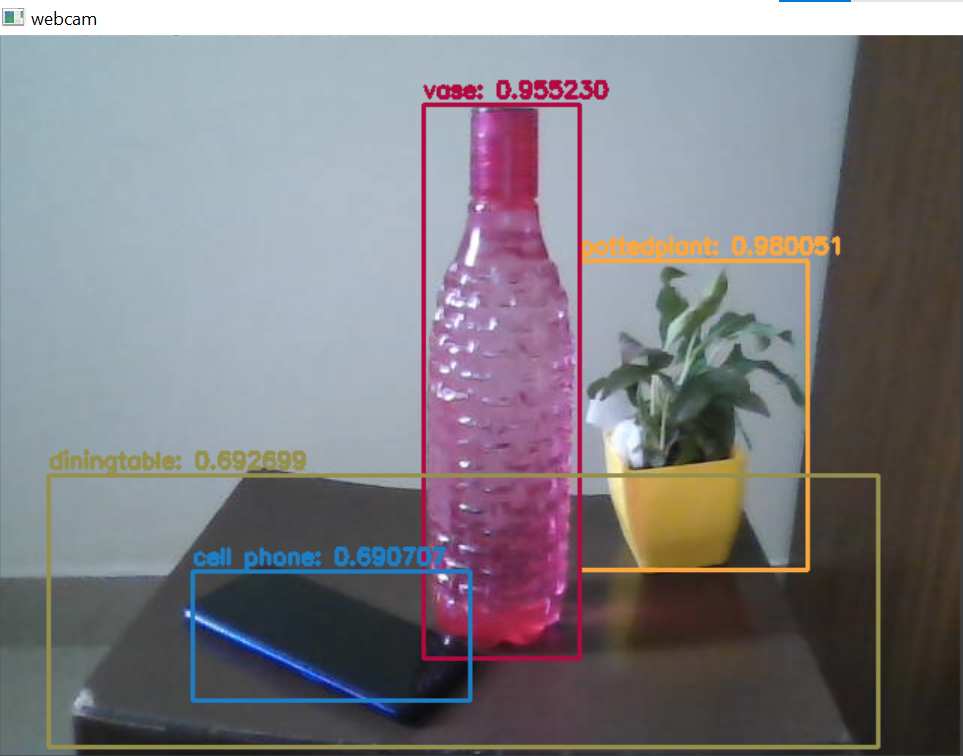
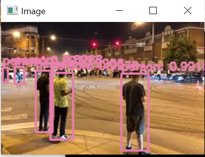

# YOLO ALGORITHM

## Contents to be discussed:
1. YOLO Algorithm
2. Different versions of YOLO
3. How the YOLO algorithm works 
   * Residual blocks
   * Bounding box Regression
   * Intersection Over Union(IOU)
4. Results
5. Applications
6. Scope for improvement

***

### **1. YOLO Algorithm**

You only look once (YOLO) is a state-of-the-art, real-time object detection system. YOLO is a convolutional neural network (CNN) for performing object detection in real-time. The YOLO algorithm works by applying a single neural network to the full image, and then dividing the image into regions and predicting bounding boxes and probabilities for each region. These bounding boxes are then weighted by the predicted class probabilities.

YOLO became popular because it gives higher accuracy and alse being able to perform object detection in real-time. The algorithm is named as  “you only looks once” as it requires only one forward propagation pass through the neural network to make predictions.

***

### **2. Different versions of YOLO**

* YOLO v1

YOLO requires a Neural Network framework for training. The first version of YOLO has 26 layers in total, with 24 Convolution Layers followed by 2 Fully Connected layers.
YOLO v1 uses Darknet framework which is trained on ImageNet-1000 dataset. 

*The major problem with YOLO v1 is that it is not able to detect very small objects which got eliminated in newer version of YOLO.*

* YOLO v2

The second version of YOLO is YOLO9000. It is faster, better and more advanced.  YOLO v2 uses Darknet 19 architecture with 19 convolutional layers and 5 max pooling layers and a softmax layer for classification objects. Anchor Boxes were introduced in YOLO v2.

*It has certain drawbacks as well. So let's move on to YOLO v3.*

* YOLO v3
 
YOLO v3 uses Darknet-53 network which has 53 convolutional layers. Key features of YOLO v3:

*Bounding Box Predictions:* 

 In YOLO v3 gives the score for the objects for each bounding boxes. It uses logistic regression to predict the objectiveness score.

*Class Predictions:*

 In YOLO v3 it uses logistic classifiers for every class. Hence, in YOLO v3 multi-label classification can be performed. 

*Feature Pyramid Networks (FPN):*

 YOLO v3 makes predictions as that of FPN-Feature Pyramid Networks where 3 predictions are made for every location in the input image and features are extracted from each prediction. 

***

#### **3. Architecture of YOLO v3**

*Regarding the architecture:*

1. YOLO v3 uses a variant of Darknet, which originally has 53 layer network trained on Imagenet.
2. For the task of detection, 53 more layers are stacked onto it, giving us a 106 layer fully convolutional underlying architecture for YOLO v3.
3. In YOLO v3, the detection is done by applying 1 x 1 detection kernels on feature maps of three different sizes at three different places in the network.
4. The shape of detection kernel is 1 x 1 x (B x (5 + C)). Here B is the number of bounding boxes a cell on the feature map can predict, '5' is for the 4 bounding box attributes and one object confidence and C is the no. of classes.
5. YOLO v3 uses binary cross-entropy for calculating the classification loss for each label while object confidence and class predictions are predicted through logistic regression.

*Hyper-parameters used*
1. class_threshold - Defines probability threshold for the predicted object.
2. Non-Max suppression Threshold - It helps overcome the problem of detecting an object multiple times in an image. It does this by taking boxes with maximum probability and suppressing the close-by boxes with non-max probabilities (less than the predefined threshold).
3. input_height & input_shape - Image size to input.

*Layers Details*
1. YOLO makes use of only convolutional layers, making it a fully convolutional network (FCN)
2. In YOLOv3 a deeper architecture of feature extractor called Darknet-53 is used.

_Convolution layers in YOLOv3_

* It contains 53 convolutional layers which have been, each followed by batch normalization layer and Leaky ReLU activation.
* Convolution layer is used to convolve multiple filters on the images and produces multiple feature maps
* No form of pooling is used and a convolutional layer with stride 2 is used to downsample the feature maps.
* It helps in preventing loss of low-level features often attributed to pooling.

***

### **How the YOLO algorithm works**

YOLO algorithm works using the following three techniques:

* Residual blocks
* Bounding box regression
* Intersection Over Union (IOU)

#### Residual Blocks

First, the image is divided into various grids. Each grid has a dimension of S x S. Every grid cell will detect objects that appear within them. For example, if an object center appears within a certain grid cell, then this cell will be responsible for detecting it.

#### Bounding box regression

A bounding box is an outline that highlights an object in an image.

Every bounding box in the image consists of the following attributes:

* Width (bw)
* Height (bh)
* Class (for example, person, car, traffic light, etc.)- This is represented by the letter c.
* Bounding box center (bx,by)

#### Intersection over Union (IOU)

Intersection over union (IOU) is a phenomenon in object detection that describes how boxes overlap. YOLO uses IOU to provide an output box that surrounds the objects perfectly.

Each grid cell is responsible for predicting the bounding boxes and their confidence scores. The IOU is equal to 1 if the predicted bounding box is the same as the real box. This mechanism eliminates bounding boxes that are not equal to the real box.

*Combination of three techniques*

First, the image is divided into grid cells. Each grid cell forecasts B bounding boxes and provides their confidence scores. The cells predict the class probabilities to establish the class of each object.

Intersection over union ensures that the predicted bounding boxes are equal to the real boxes of the objects. This phenomenon eliminates unnecessary bounding boxes that do not meet the characteristics of the objects (like height and width). The final detection will consist of unique bounding boxes that fit the objects perfectly.

***

### **4. Results**

**Output 1**

**Output 2**

**Output 3**

**Output 4**

**Output 5**

**Output 6**

***

### **5. Applications**

1. Autonomous driving: YOLO algorithm can be used in autonomous cars to detect objects around cars such as vehicles, people, and parking signals. 
2. Wildlife: This algorithm is used to detect various types of animals in forests. 
3. Security: YOLO can also be used in security systems to enforce security in an area. 

***

### **6. Scope for improvement**

As in the above output images it is observed that multiple objects that falls in one or more similar grid are not getting detected properly. The best way to improve an object detection model is to gather more representative data.